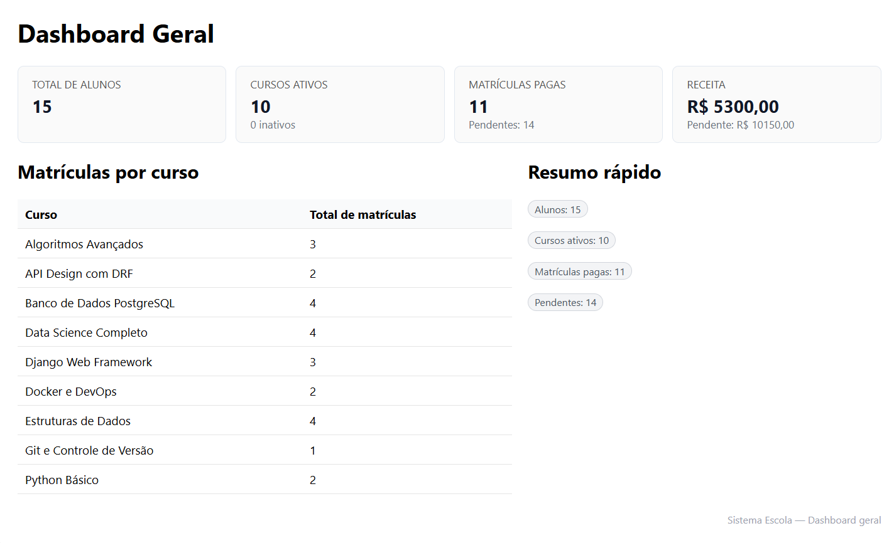
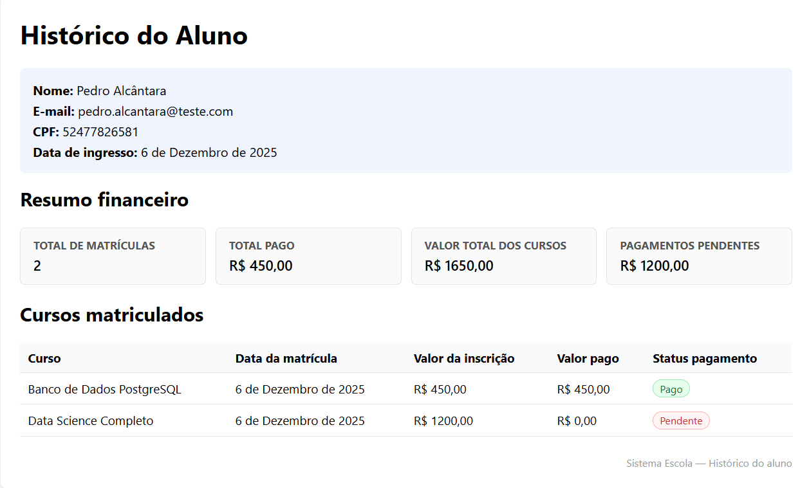
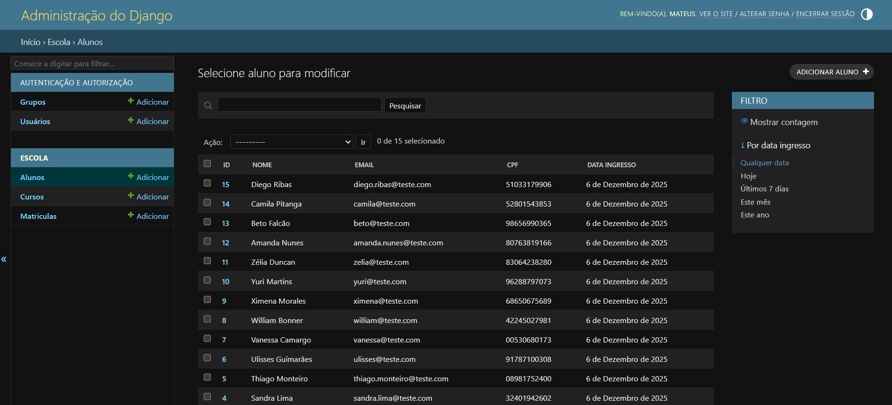

# Academia Dev Python - Desafio Técnico 2026.1

Sistema para gerenciar **alunos**, **cursos** e **matrículas** com relatórios HTML.

## Funcionalidades implementadas


- CRUD completo via API
  - `/api/alunos/` 
  - `/api/cursos/` 
  - `/api/matriculas/`

- Relatórios JSON 
  - `/api/relatorios/total_matriculas_por_curso/`
  - `/api/relatorios/total_devido_por_aluno/`
  - `/api/relatorios/pagamentos_pendentes/`
  - `/api/matriculas/por_aluno/?aluno_id=X`

- Relatórios HTML
  - Dashboard geral: totais, métricas e visão administrativa
  `http://localhost:8000/dashboard`
  - Histórico por aluno com valores pagos/pendentes
  `http://localhost:8000/alunos/<id>/historico/`

- Django Admin configurado
  - Modelos registrados
  - `list_display`, `search_fields` e filtros
  - Acesso: 
   `http://localhost:8000/admin/`

- Swagger
  - Swagger Ui:
  `http://localhost:8000/docs/swagger/`
  - Redoc Ui:
  `http://localhost:8000/docs/redoc/`

- Docker completo
  - Django + PostgreSQL + PgAdmin
  - inicialização do db com `meu_database.sql`

- Seed de dados 
  -  Arquivo load_seeds.py permite popular o banco com usuários, cursos e matrículas (aplicar esse comando quando os serviços estiverem subido)
    ```bash
    docker-compose exec web python load_seeds.py
    ```

## Requisitos

- Docker 
- Docker Compose
- Git

## Como rodar

1. Clone o repositorio (substitua <diretorio> pelo caminho em que deseja clonar)

    ```bash
    git clone https://github.com/M2004GV/academia-dev-python.git <diretorio>
    cd <diretorio>
    ```

2. Configure as variáveis de ambiente

  Copie `.env_example` para `.env` e ajuste as credenciais. O arquivo já contém valores do desenvolvimento Docker.
  ```bash
cp .env_example .env
  ```
  O arquivo .env_example já contém valores compatíveis com Docker:
  - Credenciais do PostgreSQL
  - Credenciais do PgAdmin
  - Nome do banco
  - Config. do Django

    **Importante**: a chave `SECRET_KEY` deve ser única. Você pode gerar uma chave aleatório executando:

  ```bash

  docker-compose exec web python -c "from django.core.management.utils import get_random_secret_key as k; print(k())"
  ```

   Copie o resultado para a variável `SECRET_KEY` no seu `.env`

3. Build e subir:

    ``` bash
    docker-compose up -d --build 
    ```
    O compose criará a imagem do django, inicializará o PostgreSQL com as tabelas definidas em `meu_database.sql` e disponibilizará o PgAdmin na porta 5050

4. **Acesse a aplicação**:

   - **Frontend (HTML)**:
     - Dashboard: [http://localhost:8000/dashboard/](http://localhost:8000/dashboard/)
     - Histórico do aluno: [http://localhost:8000/alunos/1/historico/](http://localhost:8000/alunos/1/historico/) (substitua `1` pelo ID do aluno).

   - **API REST** (prefixo `/api/`):
     - Alunos: `http://localhost:8000/api/alunos/`
     - Cursos: `http://localhost:8000/api/cursos/`
     - Matrículas: `http://localhost:8000/api/matriculas/`
     - Relatórios JSON: `http://localhost:8000/api/relatorios/total_matriculas_por_curso/`, `total_devido_por_aluno/` e `pagamentos_pendentes/`

   - **Django Admin**: [http://localhost:8000/admin/](http://localhost:8000/admin/)
   <br>
  
      Crie um superusuário: 

      ```bash
      docker-compose exec web python manage.py createsuperuser
      ```

   - **PgAdmin**: [http://localhost:5050](http://localhost:5050). 
   Use as credenciais definidas em `.env_example`:
      ```ini
        PGADMIN_USER=admin@admin.com
        PGADMIN_PASSWORD=admin
      ```

      - Clique em **Add New Server**
      - Aba *General*:  
         - Name: `PostgresLocal`
      - Aba *Connection*:  
          - Host: `db`  
         - Port: `5432`  
         - Username: `escola_user`  
         - Password: `escola_pass`
      - Salvar


      **[Clique aqui para ver o Tutorial Visual de Conexão ](docs/tutorial_pgadmin.md)**

      

##  Uso da API

Os endpoints seguem o padrão REST do Django Rest Framework. Exemplos de uso com `curl`:

```bash
# Listar alunos
curl http://localhost:8000/api/alunos/

# Criar novo aluno
curl -X POST http://localhost:8000/api/alunos/ \
     -H "Content-Type: application/json" \
     -d '{"nome":"João","email":"joao@example.com","cpf":"12345678901"}'

# Matrículas de um aluno específico (aluno_id=1)
curl http://localhost:8000/api/matriculas/por_aluno/?aluno_id=1

# Total devido por aluno
curl http://localhost:8000/api/relatorios/total_devido_por_aluno/
```

## Telas do Sistema

     Dashboard Geral
  

     Histórico do Aluno
  

     Django Admin

  

## Observações importantes

- A aplicação usa ``managed=False`` nos modelos para aproveitar as tabelas criadas via SQL no `meu_database.sql`.  Isso evita conflitos entre migrations e a estrutura definida no desafio.
- Os relatórios HTML podem ser acessados mesmo sem dados; experimente cadastrar alunos, cursos e matrículas via API ou admin para ver os gráficos.
- Swagger gera documentação automática de todos os endpoints DRF usando `drf-yasg`
