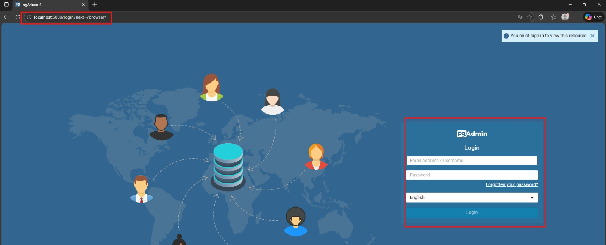
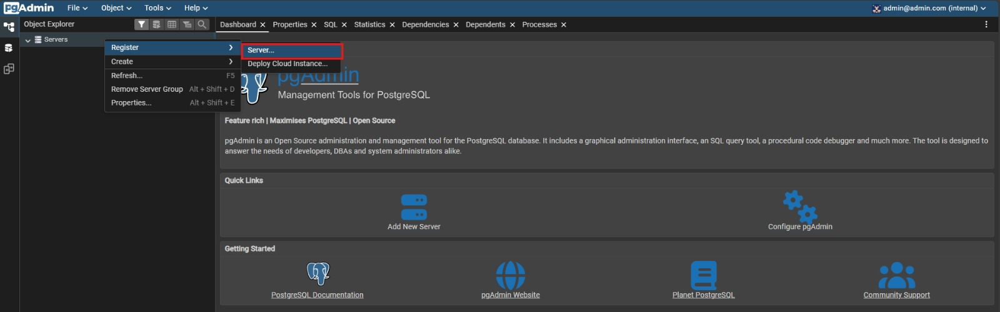
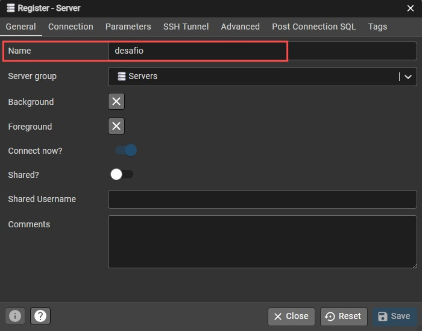
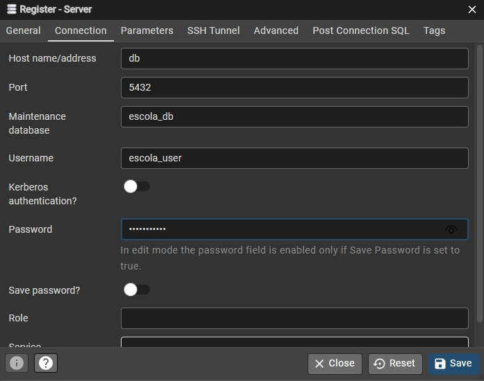
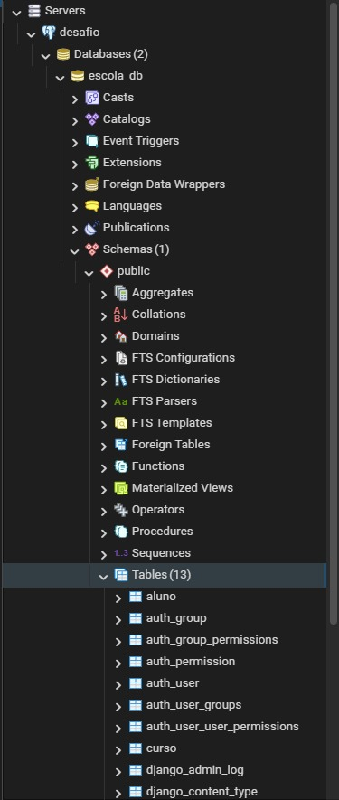

# Guia de Conexão: PgAdmin 4

Este guia auxilia na configuração da conexão entre o painel administrativo PgAdmin e o banco de dados PostgreSQL rodando via Docker.

### 1. Acesso Inicial
Acesse [http://localhost:5050](http://localhost:5050).
Use as credenciais definidas no seu `.env_example` (padrão: `admin@admin.com` / `admin`).

### 2. Criar Nova Conexão
No menu lateral esquerdo, clique com o botão direito em **Servers** > **Register** > **Server...**

### 3. Configuração Geral
Na aba **General**, dê um nome para a conexão 

### 4. Configuração de Conexão 
Vá para a aba **Connection** e preencha exatamente assim:

* **Host name/address:** `db` (Este é o nome do serviço no docker-compose.yml)
* **Port:** `5432`
* **Maintenance database:** `escola_db`
* **Username:** `escola_user`
* **Password:** `escola_pass` (ou a senha que você definiu no .env)

### 5. Sucesso
Clique em **Save**. Se tudo estiver correto, o servidor aparecerá na lista à esquerda e você poderá explorar as tabelas em **Schemas > public > Tables**.

